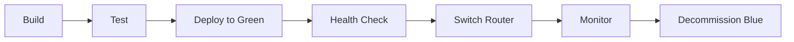

# CI/CD Strategy for Figure Collector Services

## Architecture Overview

Figure Collector uses a multi-service microservices architecture with automated CI/CD pipelines for each service. The system implements comprehensive security scanning, automated testing, and staged deployment strategies.

## Pipeline Triggers

### Pull Request Pipeline
**Trigger:** PR opened/updated to `develop` or `main`
**Actions:**
1. Build Docker image (no push)
2. Run unit tests
3. Execute security scanning (Trivy, Grype)
4. Generate SBOM without attestation
5. Report results as PR checks

### Develop Branch Pipeline
**Trigger:** Merge to `develop`
**Actions:**
1. Build and push image with `develop` tag
2. Full security scan with vulnerability reporting
3. SBOM generation and attestation
4. Trigger integration tests
5. Create GitHub issues for HIGH/CRITICAL vulnerabilities

### Main Branch Pipeline
**Trigger:** Merge to `main`
**Actions:**
1. Build and push with version tags + `latest`
2. Production security scanning
3. SBOM attestation to registry
4. Create GitHub release
5. Deploy to production environment

### Scheduled Pipelines
**Trigger:** Cron schedule
- Daily 2 AM UTC: Security rescan
- Sunday 3 AM UTC: Comprehensive scan
**Actions:**
1. Scan all published images
2. Update/create GitHub issues
3. Send Discord notifications for critical issues

## Image Tagging Strategy

### Development Images
```
ghcr.io/rpgoldberg/[service]:develop
ghcr.io/rpgoldberg/[service]:pr-[number]
ghcr.io/rpgoldberg/[service]:test-[version]
```

### Production Images
```
ghcr.io/rpgoldberg/[service]:latest
ghcr.io/rpgoldberg/[service]:v[version]
ghcr.io/rpgoldberg/[service]:[branch]-[sha]
```

## Security Integration

### Build-Time Security
1. **Dependency Scanning**
   - npm audit during build
   - Trivy filesystem scan
   - License compliance check

2. **Container Scanning**
   - Base image vulnerability scan
   - Layer-by-layer analysis
   - Secret detection

3. **SBOM Generation**
   - SPDX format for compliance
   - CycloneDX for tool compatibility
   - Attestation attached to images

### Runtime Security
1. **Continuous Monitoring**
   - Daily vulnerability rescans
   - Dependabot PR creation
   - Security advisory tracking

2. **Alert Mechanisms**
   - GitHub Security advisories
   - Discord webhook notifications
   - Automated issue creation

## Testing Strategy

### Unit Tests
- **Backend:** Jest with 80%+ coverage
- **Frontend:** React Testing Library + Jest
- **Scraper:** Mock browser testing
- **Version Manager:** Jest configuration tests

### Integration Tests
- 133 comprehensive test scenarios
- Docker-based test environment
- Cross-service communication validation
- Authentication flow testing

### Test Execution Matrix
```yaml
matrix:
  service: [backend, frontend, scraper, version-manager]
  node-version: [18.x, 20.x]
  test-type: [unit, integration, e2e]
```

## Deployment Strategies

### Blue-Green Deployment


### Rollback Procedure
1. Revert router to previous version
2. Validate health checks
3. Investigate failure
4. Create hotfix if needed

## Environment Configuration

### GitHub Secrets Required
```yaml
Registry:
  - GITHUB_TOKEN (auto-provided)

Security:
  - DISCORD_WEBHOOK
  - SONAR_TOKEN (optional)

Deployment:
  - PROD_HOST
  - PROD_SSH_KEY
```

### Environment Variables
```bash
# Image versions
BACKEND_TAG=test-2.0.0
FRONTEND_TAG=test-2.0.0
SCRAPER_TAG=test-2.0.0
VERSION_MANAGER_TAG=test-1.1.0

# Service URLs
API_URL=http://backend:5000
SCRAPER_URL=http://page-scraper:3005

# Security
SEVERITY_THRESHOLD=HIGH
CREATE_ISSUES=true
```

## Workflow Files Structure

### Reusable Workflows
```
.github/workflows/
├── sbom-security-scan.yml     # Shared security scanning
├── docker-publish.yml          # Service-specific build
├── scheduled-security-scan.yml # Periodic rescanning
└── integration-tests.yml       # Cross-service testing
```

### Service Workflows
Each service contains:
- `docker-publish.yml` - Build and publish
- `scheduled-security-scan.yml` - Security monitoring
- Service-specific test workflows

## Quality Gates

### Required Checks for Merge
- [ ] All tests passing (100%)
- [ ] Security scan: No CRITICAL vulnerabilities
- [ ] Code coverage ≥ 80%
- [ ] SBOM generated successfully
- [ ] Docker build successful
- [ ] Integration tests passing

### Optional Quality Checks
- SonarCloud analysis
- Dependency license compliance
- Performance benchmarks

## Monitoring and Observability

### Build Metrics
- Build duration
- Success/failure rate
- Image size trends
- Vulnerability count over time

### Runtime Metrics
- Deployment frequency
- Lead time for changes
- Mean time to recovery (MTTR)
- Change failure rate

## Continuous Improvement

### Regular Reviews
- Monthly: Pipeline performance review
- Quarterly: Security posture assessment
- Bi-annual: Architecture review

### Automation Opportunities
- Auto-merge Dependabot PRs for patch updates
- Automatic rollback on health check failure
- Self-healing infrastructure

## Troubleshooting

### Common CI/CD Issues

1. **Docker build cache issues**
   ```bash
   docker builder prune --all
   ```

2. **GitHub Actions rate limiting**
   - Use `actions/cache` for dependencies
   - Implement job concurrency limits

3. **Integration test flakiness**
   - Add retry logic for network calls
   - Increase timeout values
   - Use deterministic test data

## Best Practices

1. **Keep workflows DRY**
   - Use reusable workflows
   - Centralize common configuration
   - Share action versions

2. **Secure secrets management**
   - Use GitHub environments
   - Rotate credentials regularly
   - Audit access logs

3. **Optimize build times**
   - Multi-stage Docker builds
   - Parallel job execution
   - Intelligent caching

## Future Enhancements

- [ ] Kubernetes deployment manifests
- [ ] ArgoCD GitOps integration
- [ ] Prometheus metrics export
- [ ] Advanced canary deployments
- [ ] Cost optimization automation

## References

- [GitHub Actions Documentation](https://docs.github.com/actions)
- [Docker Best Practices](https://docs.docker.com/develop/dev-best-practices/)
- [OWASP DevSecOps](https://owasp.org/www-project-devsecops-guideline/)